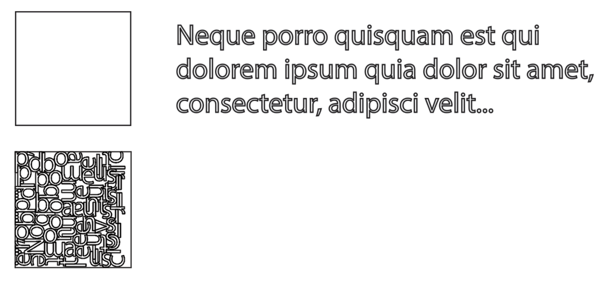
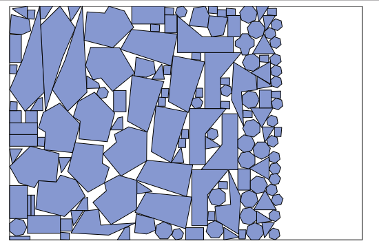

# Nest4J

Nest4J is a Nest algorithm tool written in Java which designed to run in server-side.  And it is based by [SVGNest](https://github.com/Jack000/SVGnest).

Also, Nest4J is my Undergraduate Graduation Project which let me know the charm of Computational geometry.

# What is Nest Problem?

Given a square piece of material and some letters to be laser-cut:

We want to pack all the letters into the square, using as little material as possible. If a single square is not enough, we also want to minimize the number of squares used.

In the CNC world this is called "nesting", and software that does this is typically targeted at industrial customers and very expensive.



for more detail , please go to [SVGNest](https://github.com/Jack000/SVGnest)

## Performance
I used SVGNest Demo to test Nest4J and here is my result.



## How to use?


Nest4J is based by SVGNest and ported it into Java so that it can runs in server-side.

It is esay to use Nest4J by following steps.

## Env

Nest4J needs JDK1.8 version , and the maven dependency of [Clipper-java](https://github.com/lightbringer/clipper-java). You have to download [Clipper-java](https://github.com/lightbringer/clipper-java) and install it into your local maven repository.

## Express an Polygon

Nest4J use a common way to express an polygon by a collection of Points. Here is an example to show you .


**It is important that Nest4J express polygons in an 2d coordinate system , so you have to ensure that each polygon won't be covered by another.**

```java
        NestPath bin = new NestPath();
        double binWidth = 511.822;
        double binHeight = 339.235;
        bin.add(0, 0);
        bin.add(binWidth, 0);
        bin.add(binWidth, binHeight);
        bin.add(0, binHeight);

```


## Construct an material list.

It is easy to construct a material list when we know how to express a ploygon. it's just a collection of polygons.

```java
        List<NestPath> list = new ArrayList<NestPath>();
        list.add(polygon1);
        list.add(polygon2);
        list.add(polygon3);

```

### Extended Attributes of Polygon

When one polygon is constructed , its default Rotation attr is 0 , which means we will fix it during our Nest Program. We can set it as 4 and this polygon may rotate in 90°,180°,270°. If we set Rotation attr as N, this polygon may these rotation angles `(360/N) *k , k= 0,1,2,3,...N`

Meanwhile you can use `bid` to help you identify the polygons. It is useful when we get nest result.

``` java

      polygon.bid = id;
      polygon.setRotation(4);

``` 


### Hollow Polygon

For those hollow polgyons, Nest4J provides a simple way to express by 2d coordinate system. If one polygon is inside in another by their coordinates, the Nest4J will detact it automaticly.

```java

        NestPath outer = new NestPath();
        outer.add(600, 0);
        outer.add(600, 200);
        outer.add(800, 200);
        outer.add(800, 0);
        outer.setRotation(0);
        outer.bid = 1;
        NestPath inner = new NestPath();
        inner.add(650, 50);
        inner.add(650, 150);
        inner.add(750, 150);
        inner.add(750, 50);
        inner.bid = 2;

```


### Configuration 

Before we start to nest , you can set configuration.

```java
        Config config = new Config();
        config.SPACING = 0;
        config.POPULATION_SIZE = 5;
```


<table>
    <tr>
        <td>Attr</td>
        <td>Description</td>
        <td>Default</td>
    </tr>
    <tr>
        <td>SPACING</td>
        <td>the distance of each plygons on bin</td>
        <td>0</td>
    </tr>
    <tr>
        <td>POPULATION_SIZE</td>
        <td>the number of population in GA algorithm</td>
        <td>10</td>
    </tr>
    <tr>
        <td>MUTATION_RATE</td>
        <td>the rate of mutate in GA algorithm</td>
        <td>10%</td>
    </tr> 
    <tr>
        <td>USE_HOLE</td>
        <td>allow to put polygons into hollow polygons</td>
        <td>false</td>
    </tr>     
</table>


## start to nest


When we configure the bin, the material list and the configuration, we can start to nest.

```java

     Nest nest = new Nest(bin, polygons, config, 2);
     List<List<Placement>> appliedPlacement = nest.startNest();

```


### Placement


Placement is our unit of final result , which represents a polygon with a specific `bid` placed into a rotation angel and relative coordiates to its bin of top left corner.

```java
public class Placement {
    public int bid;
    public Segment translate;
    public double rotate;


    public Placement(int bid, Segment translate, double rotate) {
        this.bid = bid;
        this.translate = translate;
        this.rotate = rotate;
    }

    public Placement() {
    }
}

```

## Visualization 

I use SVG to help us see the result. You can find it in `NestTest`.

```java
        List<String> strings = SvgUtil.svgGenerator(polygons, appliedPlacement, binWidth, binHeight);
        saveSvgFile(strings);

```


## Referenced Paper

- [López-Camacho *et al.* 2013](http://www.cs.stir.ac.uk/~goc/papers/EffectiveHueristic2DAOR2013.pdf)
- [Kendall 2000](http://www.graham-kendall.com/papers/k2001.pdf)
- [E.K. Burke *et al.* 2006](http://citeseerx.ist.psu.edu/viewdoc/download?doi=10.1.1.440.379&rep=rep1&type=pdf)


## Todo

1. make Nest4J process more parallel.


